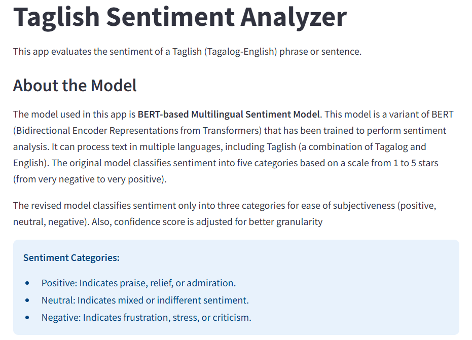
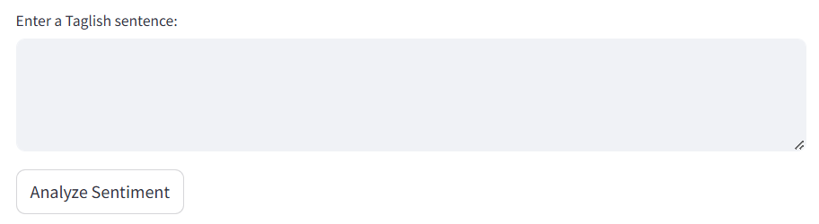

# Taglish Sentiment Analyzer
This is a Taglish Sentiment Analyzer built using the transformers library and Streamlit. The app evaluates the sentiment of a Taglish (Tagalog-English) phrase or sentence and categorizes it into Positive, Neutral, or Negative, with an associated confidence level.
# Features
1. Input Taglish sentences or phrases
2. Outputs the sentiment of the text: Positive, Neutral, or Negative
3. Displays the confidence level as a percentage
4. Simplified and user-friendly interface using streamlit
# How to use?
Access the app by clicking [here](taglish-sentiment-analysis-0909.streamlit.app).

Upon accessing, you can see the model information and how was the model revised to determine necessary outputs.

You can now type your taglish sentence or phrase.

Lastly, you can press the "Analyze Sentiment" button to determine the results.
